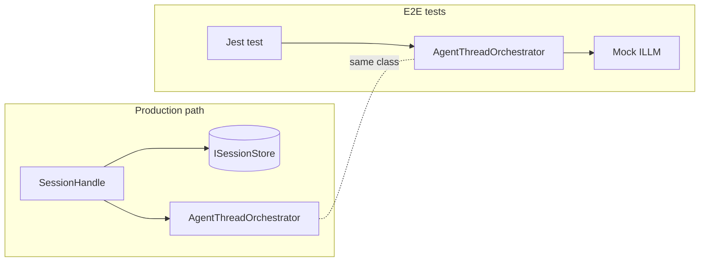
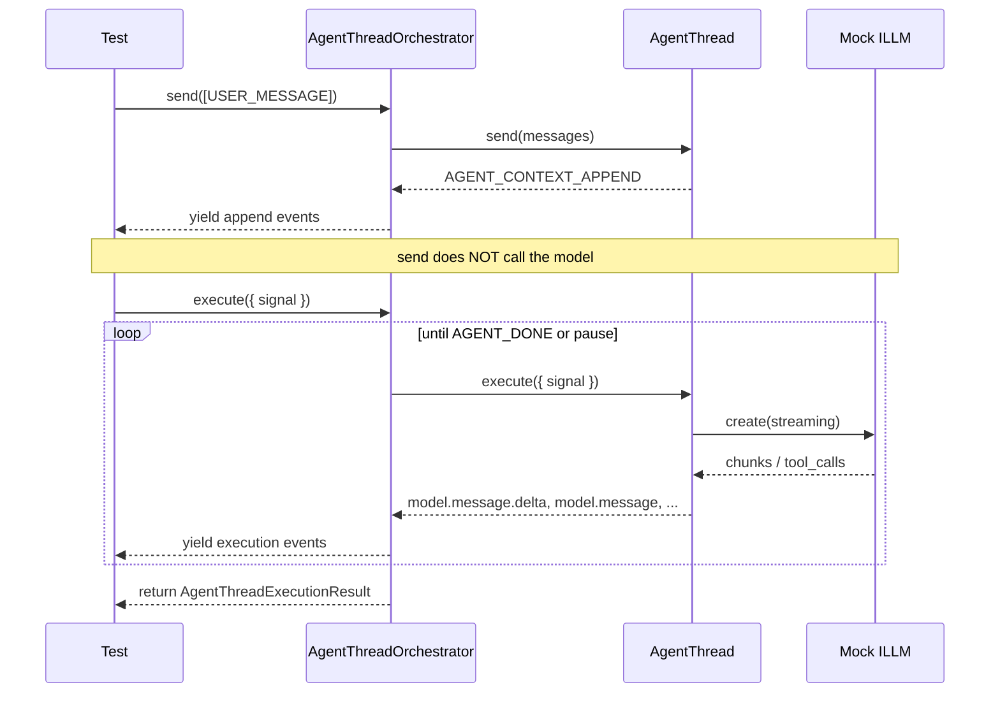
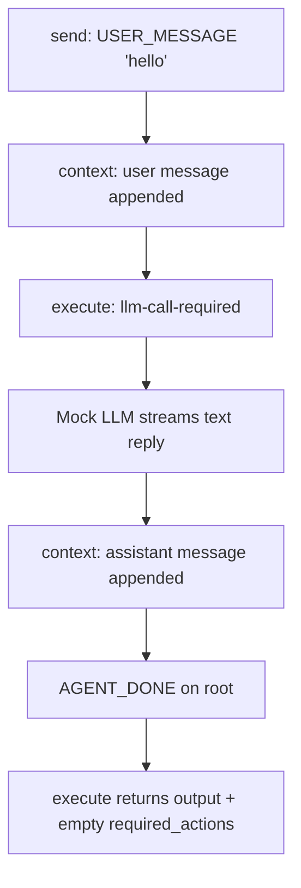
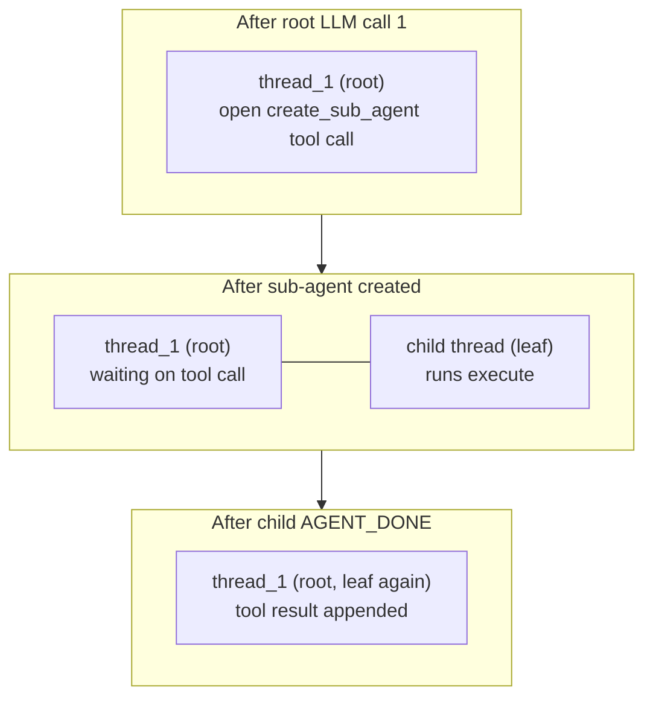
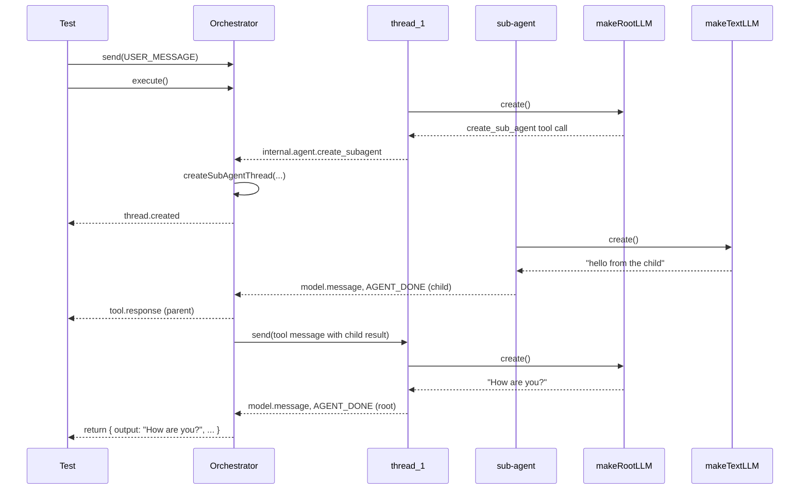

# Core runtime E2E tests

End-to-end tests for `AgentThreadOrchestrator` and `AgentThread` in `@truefoundry/trueforge-core`.

These tests wire the real orchestration loop with **mocked LLMs** and **no database**. They exist to learn and verify how a turn flows through the harness before adding persistence (`SessionHandle`), HTTP, or real model providers.

## What we are testing

| Layer                             | In scope                                                                  | Out of scope                                |
| --------------------------------- | ------------------------------------------------------------------------- | ------------------------------------------- |
| `AgentThreadOrchestrator.send`    | Route input to threads, validate, append context                          | Postgres / Redis store writes               |
| `AgentThreadOrchestrator.execute` | Run leaf threads, merge streams, spawn sub-agents, return terminal result | `TurnHandle.stream` persistence             |
| `AgentThread`                     | LLM loop, tool execution, context mutations                               | Real OpenAI / Vercel AI calls               |
| Sub-agent lifecycle               | `create_sub_agent` tool → child thread → result back to parent            | Full `SessionHandle` resolver / spec wiring |

**Goal:** prove the orchestrator correctly coordinates one root thread (Program 1) and a root + dynamic child thread (Program 2).

## Why this design

Production creates the orchestrator inside `SessionHandle.createTurn`:

```text
resolve definitions → build AgentThread map → new AgentThreadOrchestrator → send → persist → execute (via TurnHandle)
```

These E2E tests **skip the store and session layer** and talk to the orchestrator directly. That keeps the surface area small while still exercising the same `send` / `execute` contract production uses.



## Files

| File                             | Role                                                                                               |
| -------------------------------- | -------------------------------------------------------------------------------------------------- |
| `orchestration.test.ts`          | **Program 1** - single root thread, text-only reply, full assertions                               |
| `orchestrationWithTools.test.ts` | **Program 2** - root delegates to sub-agent via `create_sub_agent`, logging only (assertions TODO) |
| `helpers.ts`                     | Mock LLM streams, logger factory                                                                   |
| `jest.e2e.config.cjs`            | Jest config scoped to this folder                                                                  |

## Core components under test

### `AgentThread`

One conversation thread. Holds:

- **`definition`** - `modelClient` (`ILLM`), optional `instruction`, `toolSets`, etc.
- **`context`** - LLM message history (user, assistant, tool messages)
- **`send(messages)`** - append user input, approvals, or tool responses to context (no LLM call)
- **`execute({ signal })`** - run the state machine: LLM → tools → pause or done

### `AgentThreadOrchestrator`

Owns a `Map<threadId, AgentThread>` and coordinates a turn:

- **`send(batch)`** - fan out messages to the right threads, validate, delegate to each thread's `send`
- **`execute({ signal })`** - run **leaf** threads in parallel (up to 5), merge event streams, handle sub-agent creation/completion
- **`createDynamicSubAgentThread`** - factory callback invoked when the root calls `create_sub_agent`; must return a new `AgentThread` (not called at construction time)

### `CreateDynamicSubAgentThread`

```ts
(input: {
  parentDefinition: AgentDefinition;
  request: AgentInfo; // { type: 'dynamic', name, input, model? }
  threadId: string; // orchestrator already minted this
  parent: AgentParent; // { thread_id, tool_call_id }
  signal: AbortSignal;
}) => Promise<AgentThread>;
```

Pass the **function reference** to the orchestrator. Do not call it yourself.

## Turn lifecycle: `send` then `execute`

These are separate steps on purpose (same as production: send before commit, then execute).



**Important:** `send` returns an async generator. You must consume it with `for await`; otherwise the user message never lands in context.

**Important:** `execute` also returns an async generator. The **return value** (final assistant output, required pauses, errors) is only available after the last `next()` when `done === true`.

## Mock LLM helpers (`helpers.ts`)

| Helper                    | Behavior                                                                     |
| ------------------------- | ---------------------------------------------------------------------------- |
| `textReplyStream(text)`   | One streaming chunk + stop completion with fixed text                        |
| `makeTextLLM(text)`       | `ILLM` that always replies with `text` (used for child threads)              |
| `createSubAgentStream()`  | First root call: stream a `create_sub_agent` tool call                       |
| `makeRootLLM(finalReply)` | First `create()` → sub-agent tool call; every later call → `finalReply` text |
| `makeDummyLogger()`       | Winston logger with colorized console output for debugging                   |

Root and child threads use **different** `ILLM` instances so each can follow its own scripted sequence.

---

## Program 1: text-only happy path

**File:** `orchestration.test.ts`

### Setup

| Piece                         | Value                                        |
| ----------------------------- | -------------------------------------------- |
| Root thread id                | `"main"`                                     |
| LLM                           | `makeTextLLM("hello from the mocked model")` |
| Tool sets                     | none                                         |
| `createDynamicSubAgentThread` | rejects if ever called                       |
| Tracing                       | `NOOP_AGENT_TRACING`                         |
| Logger                        | silent (`makeSilentLogger`)                  |

### Data flow



### Expected event types

**After `send`:**

```text
internal.agent.context.append
```

**During `execute` (order may include duplicates / internal appends):**

```text
model.message.delta
model.message
internal.agent.done          ← last yielded event
```

**Must NOT appear:**

```text
thread.created
tool.response
```

### Passing expectations (assertions)

- `step.value.output.content` === `"hello from the mocked model"`
- `step.value.required_actions` === `[]`
- `step.value.root_agent_error` is undefined
- Root snapshot context contains user `"hello"` and assistant reply

---

## Program 2: sub-agent delegation

**File:** `orchestrationWithTools.test.ts`

### Setup

| Piece            | Root thread                   | Child thread                                    |
| ---------------- | ----------------------------- | ----------------------------------------------- |
| Thread id        | `"thread_1"` (fixed)          | minted by orchestrator at runtime               |
| LLM              | `makeRootLLM("How are you?")` | `makeTextLLM("hello from the child")`           |
| Tool sets        | `[new DynamicSubAgents(...)]` | `undefined` (no nested sub-agents)              |
| Instruction      | test setup string             | `undefined` (harness adds `SUB_AGENT_IDENTITY`) |
| Initial messages | none                          | `[{ role: 'user', content: request.input }]`    |
| Parent link      | none                          | `{ thread_id, tool_call_id }` from orchestrator |

`createSubAgentThread` is a top-level `CreateDynamicSubAgentThread` implementation (mirrors a simplified `SessionHandle.makeCreateDynamicSubAgentThread`).

### Scripted LLM behavior

1. **Root call 1** - model returns `create_sub_agent` with `{ name: 'worker', input: '...' }`
2. **Child call 1** - model returns `"hello from the child"`
3. **Root call 2** - model returns `"How are you?"`

### Thread tree over time



Only **leaf** threads run. While the child exists, the root is paused (not a leaf). When the child finishes, the orchestrator:

1. Yields `tool.response` on the parent
2. `send()`s the child's result into the parent as a tool message
3. Removes the child from the thread map
4. Resumes the root for LLM call 2

### Data flow



### Expected event types (from logging)

Typical `execute` event sequence:

```text
model.message / model.message.delta     ← root tool call
internal.agent.context.append           ← (internal, may repeat)
thread.created                          ← child registered
model.message / model.message.delta     ← child reply
tool.response                           ← child result routed to parent
internal.agent.done                     ← child finished (thread_id = child)
model.message / model.message.delta     ← root final reply
internal.agent.done                     ← root finished (last event)
```

`internal.agent.create_subagent` is handled inside the orchestrator and is **not** yielded to the test consumer.

### Expected final state

**`execute` return value:**

| Field              | Expected                                            |
| ------------------ | --------------------------------------------------- |
| `output.content`   | `"How are you?"` (root final reply, not child text) |
| `required_actions` | `[]`                                                |
| `root_agent_error` | undefined                                           |

**Root thread context (after send + execute):**

```text
1. user:      "hello"
2. assistant: tool_call create_sub_agent (id: call-sub)
3. tool:      "hello from the child"
4. assistant: "How are you?"
```

### Current test status

Program 2 currently **logs** events and the final result via `makeDummyLogger()`. It does **not** yet assert on event types or final state. Add the same style of expectations as Program 1 when ready.

Suggested assertions to add:

```ts
expect(types).toContain(EventType.THREAD_CREATED);
expect(types).toContain(EventType.TOOL_RESPONSE);
expect(types.at(-1)).toBe(InternalEventType.AGENT_DONE);
expect(step.value.output?.content).toBe('How are you?');
```

---

## Running tests

From `packages/trueforge-core`:

```bash
pnpm test:e2e
```

Single file:

```bash
pnpm test:e2e -- orchestration.test.ts
pnpm test:e2e -- orchestrationWithTools.test.ts
```

From repo root:

```bash
pnpm test:trueforge-core:e2e
```

E2E tests use `jest.e2e.config.cjs` (`maxWorkers: 1`, 60s timeout). Unit tests under `tests/` (excluding `tests/e2e/`) run separately via `jest.config.cjs`.

## Logging during tests

- `tests/setup.ts` mocks `console.log` / `console.warn` / `console.error` for all Jest runs, including E2E.
- `makeDummyLogger()` uses Winston's `Console` transport and **does** print to the terminal.
- Program 2 logs:
  - `send complete` with event types
  - each `execute event` with `type` and `thread_id`
  - `execute result` with full type list and terminal output

The orchestrator itself does not log on the happy path. Test-side logging is intentional for learning.

To debug with less noise, run a single file (see above).

## Relationship to production

| E2E test                               | Production equivalent                                  |
| -------------------------------------- | ------------------------------------------------------ |
| `new AgentThread({ definition, ... })` | `SessionHandle.buildThreads` + resolver                |
| `createSubAgentThread` callback        | `SessionHandle.makeCreateDynamicSubAgentThread`        |
| `orchestrator.send` + `execute`        | `SessionHandle.createTurn` + `TurnHandle.stream`       |
| In-memory `thread.toSnapshot()`        | `ISessionStore.createTurn` / persisted context appends |
| `NOOP_AGENT_TRACING`                   | `resolver.createTracing()`                             |

Production adds: store persistence, turn records, event folding for SSE, sandbox resolution, full builtin capabilities from `AgentSpec`, and MCP servers beyond `DynamicSubAgents`.

## Planned coverage (not yet implemented)

| Program | Scenario                                                                                           |
| ------- | -------------------------------------------------------------------------------------------------- |
| **3**   | Pause on `tool.approval.required` or `tool.response.required`, then resume with `send` + `execute` |
| **4**   | Reject user message while sub-agent is live (`InvalidAgentSendInputError`)                         |
| **5**   | MCP auth required (`internal.mcp.auth_required` merge across parallel sub-agents)                  |

## Quick reference: orchestrator inputs

```ts
new AgentThreadOrchestrator({
  agentThreads: new Map([[rootThreadId, rootThread]]),
  createDynamicSubAgentThread, // function reference, not a call
  tracing: NOOP_AGENT_TRACING,
  logger,
});
```

Every turn:

```ts
for await (const _ of orchestrator.send(input)) {
  /* collect appends */
}
const it = orchestrator.execute({ signal });
let step = await it.next();
while (!step.done) {
  // step.value is a streamed execution event
  step = await it.next();
}
// step.value is AgentThreadExecutionResult
```
